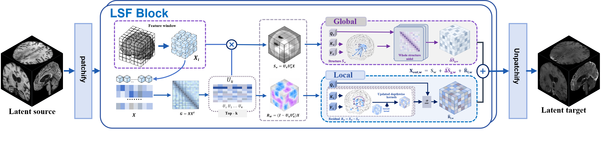
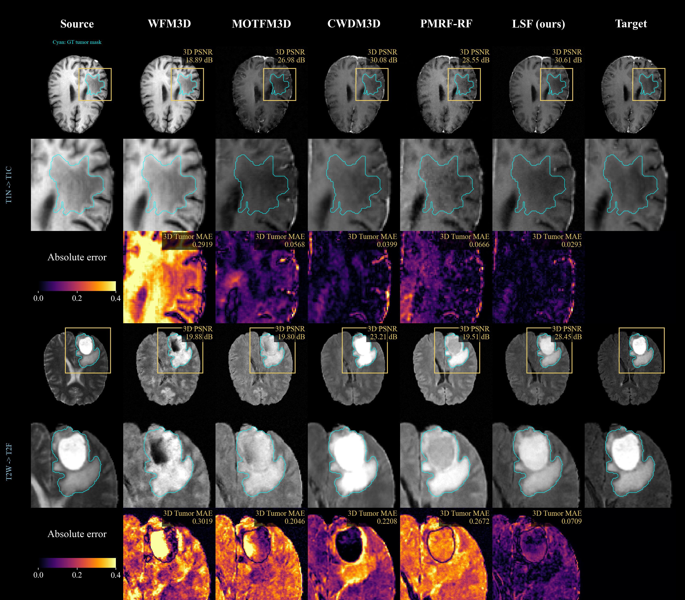
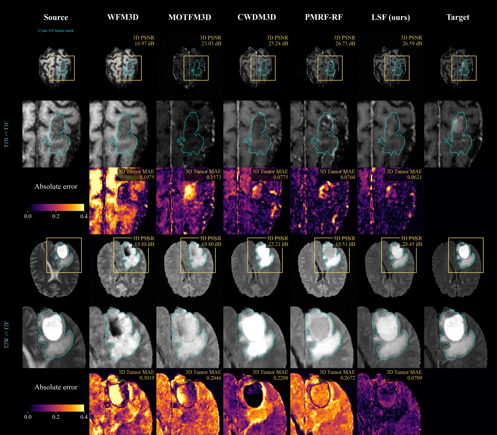
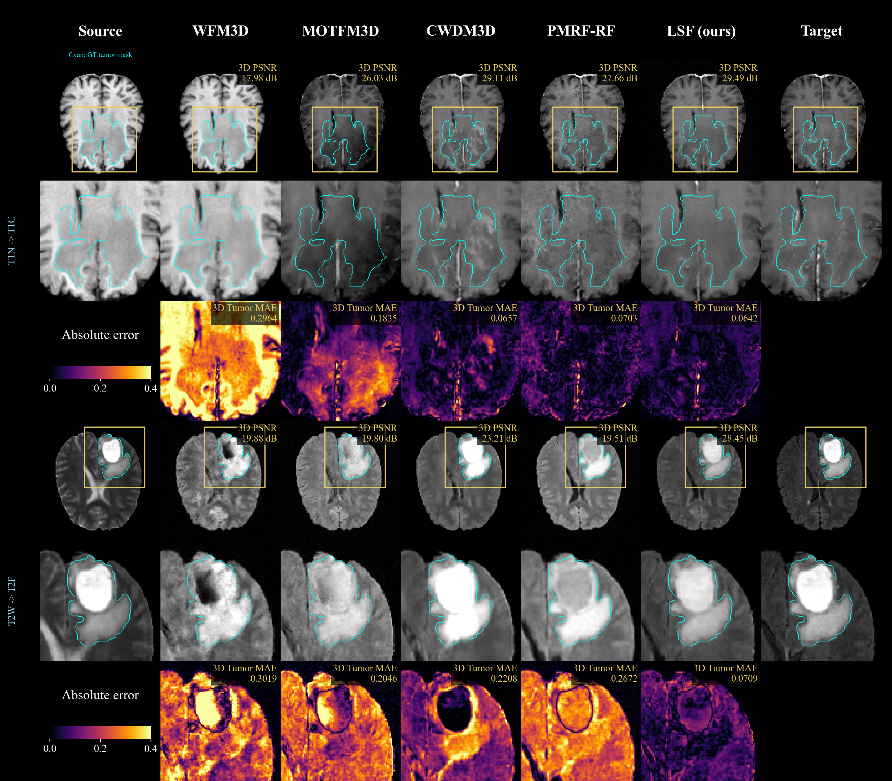
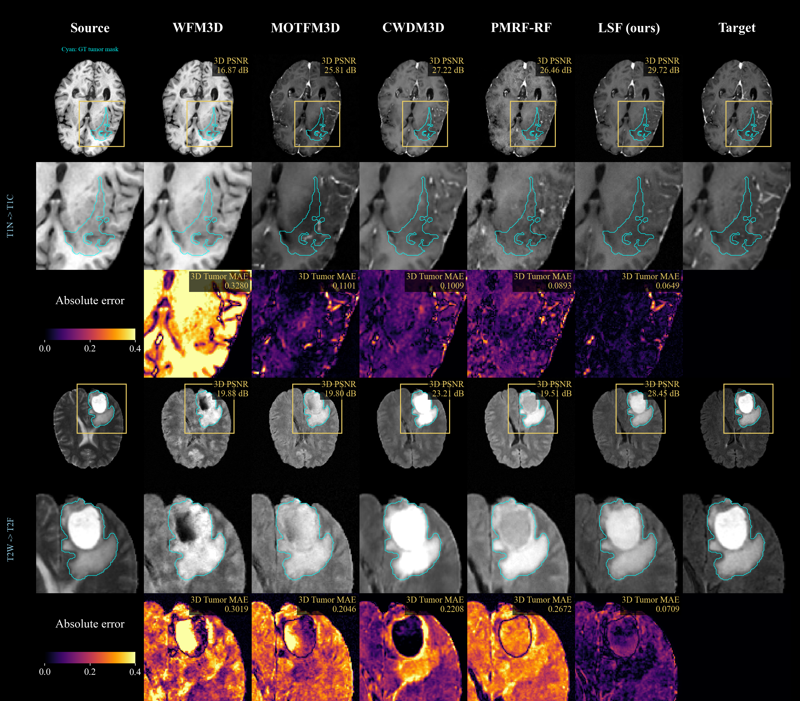
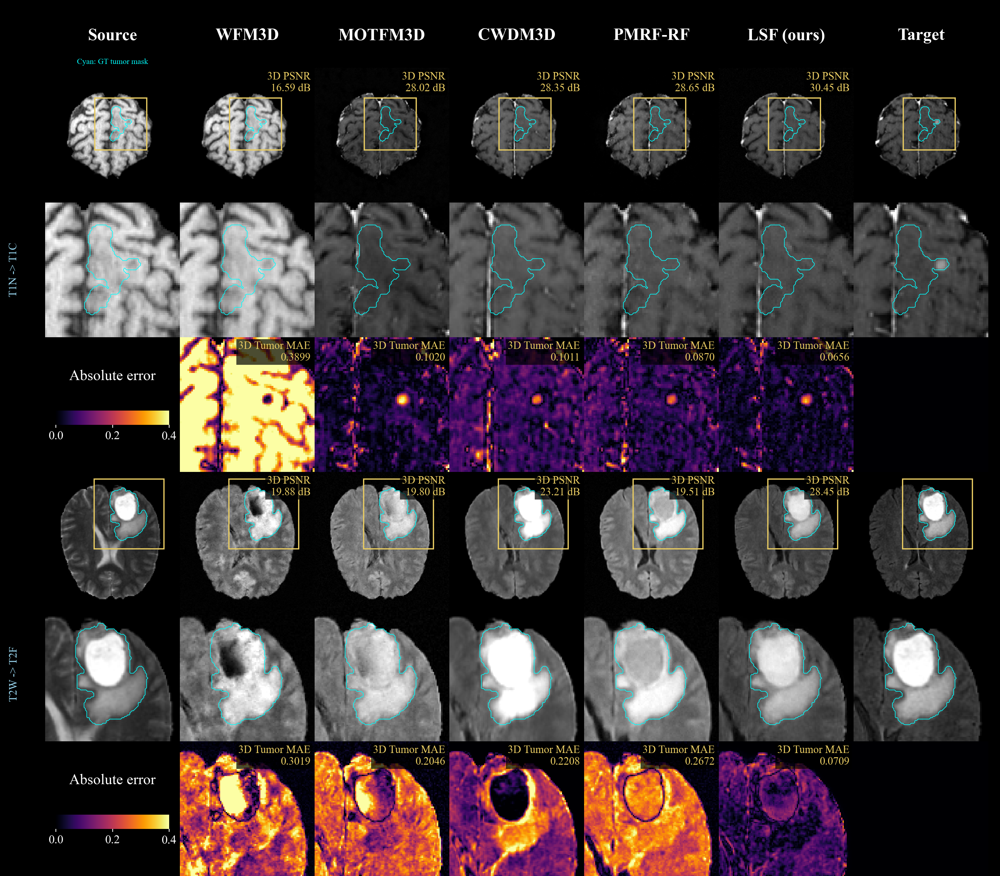
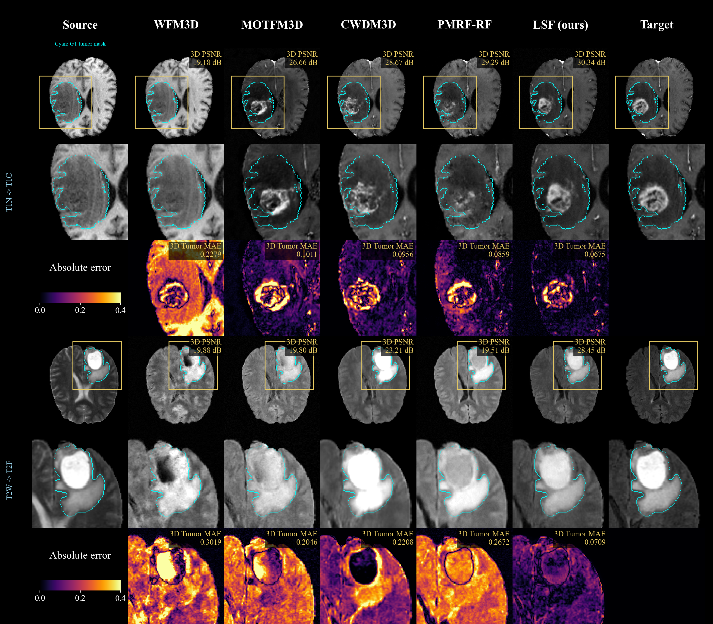
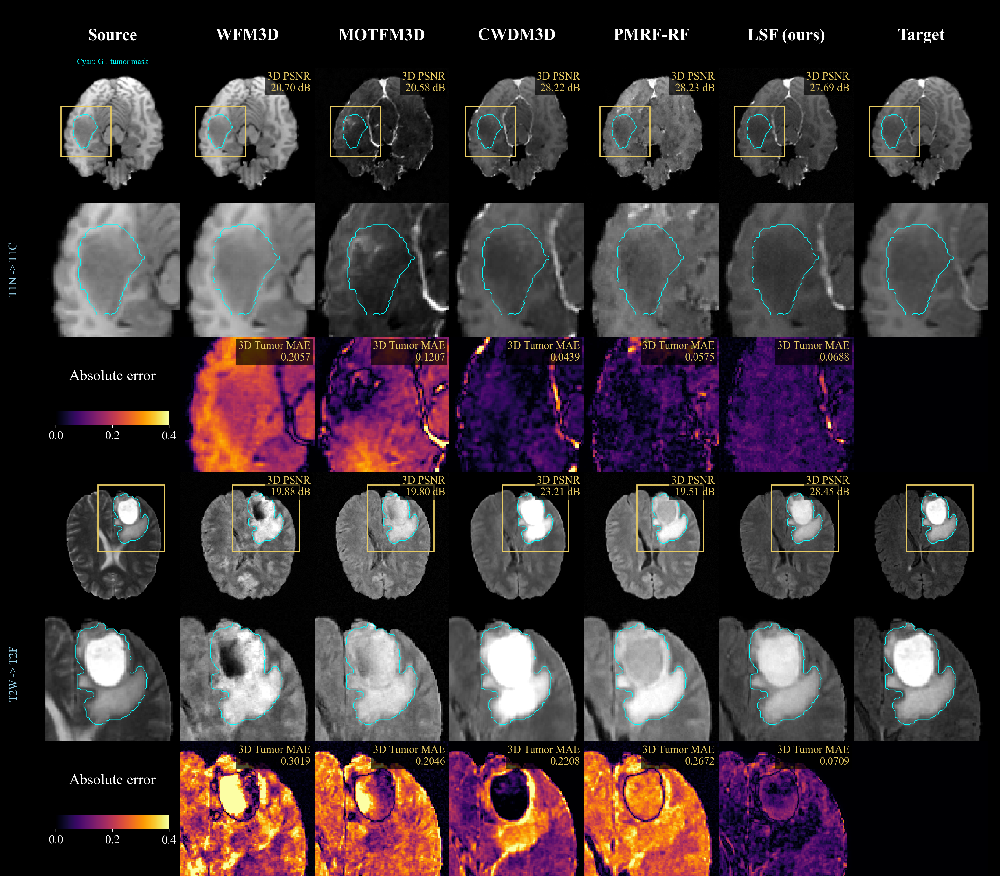
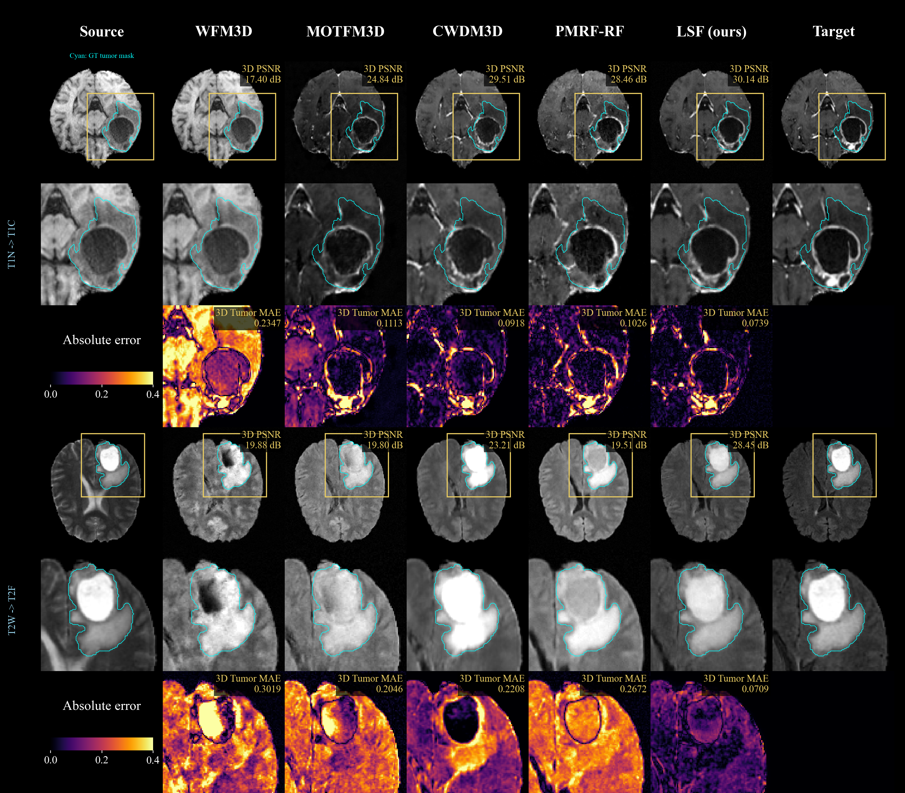
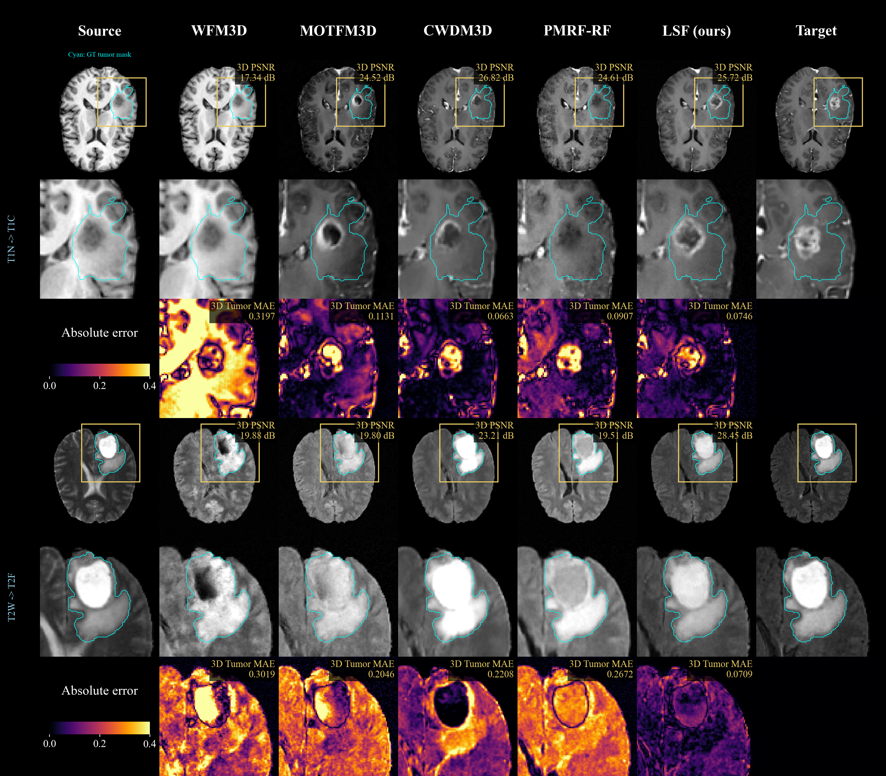

# Latent Space Is Not Flat: Rethinking Latent Structure for 3D Medical Image Synthesis

## Framework



## Data Preparation

Use Python 3.10+ and a CUDA-compatible installation of PyTorch 2.5+.
Run the following Python commands from the package root in Windows PowerShell or Linux/AutoDL.


| File | Path relative to the package root |
|---|---|
| T1N-to-T1C H5 dataset | `data/h5/t1n__t1c_3d.h5` |
| T2W-to-T2F H5 dataset | `data/h5/t2w__t2f_3d.h5` |
| MAISI autoencoder weights | `ae_assets/maisi_v1/autoencoder_v1.pt` |

Use authorized, locally preprocessed [BraTS-GLI data](https://www.synapse.org/Synapse:syn51156910).
Each H5 file contains disjoint `train/val/test` groups with `source/target` [N,1,D,H,W],
`mask` [N,3,D,H,W], and `subject_id` [N]. Image and mask values must be finite and within [0,1].
The existing 155x256x256 volumes are padded internally and exported at their original size.
The frozen autoencoder uses the pinned [NV-Generate-CT checkpoint](https://huggingface.co/nvidia/NV-Generate-CT/resolve/a481248bbd6462129efb2a3514e142bb95f87b25/models/autoencoder_v1.pt?download=true).
Both the download script and the loader verify its SHA256. Datasets and weights are not bundled.

```bash
python -m pip install -r requirements.txt
python scripts/check_dataset.py --task t1n_t1c --scan
python scripts/download_ae.py
python -u precompute_latents.py --task t1n_t1c --device cuda --resume
```

Precompute the complete latent cache before training; the training script does not create it automatically.
Caches are stored under `data/latents/maisi_v1/`, separately for each task and shared by its P2/P4/P8 configurations.
Use `--task t2w_t2f` to prepare T2 data. For datasets stored outside the package, specify the same
`--h5-path` during data preparation, training, prediction export, and evaluation.

## Run

```bash
python -u train.py --config configs/t1n_t1c_p4.yaml --device cuda
```

Select the T1/T2 and P2/P4/P8 YAML configuration in [configs](configs); all use d1 with MDSA enabled.
Results are saved under `outputs/`; repeating the same command resumes training from `checkpoints/last.pt`.
Use a new output directory when changing settings. Legacy voxel-space or d124 weights, and checkpoints from
other patch sizes, are incompatible. Historical P2 checkpoints must also match this package's model contract.

For P2, use `--config configs/t1n_t1c_p2.yaml` or `--config configs/t2w_t2f_p2.yaml` in the training command.
P2 divides the 48x64x64 latent into 24x32x32 tokens (24,576 total), eight times as many as P4, so it requires
more memory and computation. These configurations retain this release's d1 local branch and MDSA settings
(rank 8, blocks 4 and 5 with zero-based indexing); changing the patch size alone does not reproduce all paper settings.
The run directory uses `latent-p2` in place of `latent-p4` in the export example below.
P2 runtime and real-MAISI synthetic workflow checks passed; see [validation details](docs/p2_validation.json).
Recheck with `python scripts/smoke_cuda.py --patches 2` or `python scripts/smoke_pipeline.py --patch 2`
(the latter requires the pinned MAISI checkpoint). These checks do not measure full-dataset quality or convergence.

## Evaluation

```bash
python -u export_predictions.py --run-dir outputs/t1n_t1c__ldm__latent-p4__d1__mdsa-conditioned__seed0 --checkpoint best --split test --output-dir evaluation/t1_p4_test --device cuda
python -u evaluate.py --task t1n_t1c --predictions evaluation/t1_p4_test/predictions_test.h5 --split test --output-dir evaluation/t1_p4_test/metrics --device cuda
```

Use the corresponding run directory and task name for other configurations. Export selects the EMA
checkpoint with the best validation score and uses its sampling settings; existing predictions are not overwritten.
Outputs include prediction volumes, diagnostic PNGs, per-subject metrics in CSV, and a summary JSON.
Evaluation requires an exact match between prediction IDs and test-set IDs and excludes padding.
Full-volume and brain metrics are reported separately, with [0,1] clipping, no brain-exterior zeroing,
a PSNR data range of 1, and a uniform 7x7x7 SSIM window. MAE is also computed within the tumor-union mask
and the top-5%-change ROI within the foreground union. Summaries report subject-wise means and sample SDs.

<a id="acknowledgements"></a>

## Acknowledgements

We thank the BraTS contributors, [NVIDIA MAISI](https://github.com/NVIDIA-Medtech/NV-Generate-CTMR),
[MONAI](https://github.com/Project-MONAI/MONAI).


<table>
<tr><td width="33%"><a href="assets/qualitative/case_01.png"></a></td><td width="33%"><a href="assets/qualitative/case_02.png"></a></td><td width="34%"><a href="assets/qualitative/case_03.png"></a></td></tr>
<tr><td width="33%"><a href="assets/qualitative/case_04.png"></a></td><td width="33%"><a href="assets/qualitative/case_05.png"></a></td><td width="34%"><a href="assets/qualitative/case_06.png"></a></td></tr>
<tr><td width="33%"><a href="assets/qualitative/case_07.png"></a></td><td width="33%"><a href="assets/qualitative/case_08.png"></a></td><td width="34%"><a href="assets/qualitative/case_09.png"></a></td></tr>
</table>
